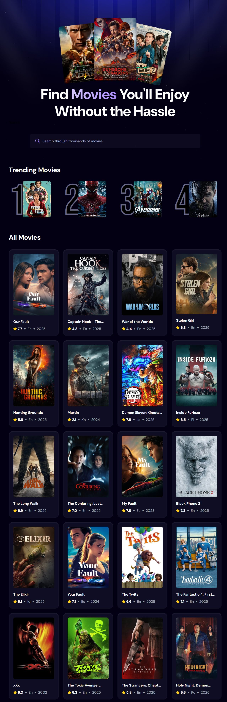
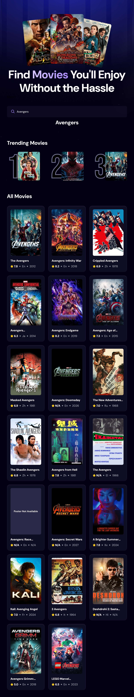
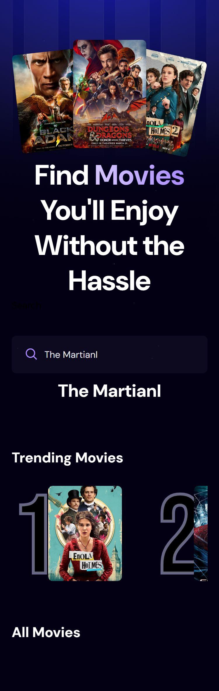

# 🎬 MovieVerse — Explore, Search & Discover Movies

<p align="center">
  
  
  
  
  
</p>

A sleek and modern **Movie Application** built with **React.js** and powered by **Appwrite**.  
Search through thousands of movies, view posters, titles, release dates, and IMDb ratings — all in one responsive, dynamic app.

---

## 🚀 Features

- 🔍 **Smart Search Functionality** — Search through thousands of movies in real-time.  
- ⚡ **Debouncing Optimization** — Reduces unnecessary API calls for faster performance.  
- 🧠 **Appwrite Integration** — Stores and tracks recent searches and movie counts.  
- 📈 **Trending Section** — Displays top 5 most-searched movies from the Appwrite database.  
- 🎨 **Fully Responsive** — Works seamlessly on mobile, tablet, and desktop.  
- 🌐 **Deployed on Vercel** — Fast and reliable production hosting.

---

## 🦈 Tech Stack

| Category | Technologies Used |
|-----------|------------------|
| **Frontend** | React.js, Vite, CSS3 |
| **Backend / BaaS** | Appwrite |
| **API** | The Movie Database (TMDB) API |
| **Optimization** | Debouncing (`react-use`) |
| **Hosting** | Vercel |
| **Version Control** | Git & GitHub |

---

## ⚙️ Installation & Setup

Follow these steps to run the project locally:

```bash
# 1️⃣ Clone the repository
git clone https://github.com/your-username/movieverse.git

# 2️⃣ Navigate into the project
cd movieverse

# 3️⃣ Install dependencies
npm install

# 4️⃣ Add environment variables
# Create a .env file in the root folder and add:
VITE_TMDB_API_KEY=your_tmdb_api_key
VITE_APPWRITE_ENDPOINT=https://cloud.appwrite.io/v1
VITE_APPWRITE_PROJECT_ID=your_project_id

# 5️⃣ Run the development server
npm run dev

```
---
## 🗄️ Folder Structure
```
movieverse/
├── src/
│   ├── components/
│   │   ├── Search.jsx
│   │   ├── MovieCard.jsx
│   │   └── Spinner.jsx
│   ├── appwrite/
│   │   └── index.js
│   ├── App.jsx
│   ├── index.css
│   └── main.jsx
└── public/
```
---
## 🧠 Core Concepts Implemented

- Debounced Search: Optimized API calls by waiting for user input to stabilize.

- Appwrite Integration: Used Appwrite for storing and counting recent searches.

- Trending Algorithm: Displayed the most searched movies dynamically.

- API Integration: Fetched real-time movie data from TMDB API.

- Responsive Design: Styled using modern CSS for all screen sizes
---

## 🌟 Live Demo

- 🔗 Frontend (Vercel): https://pranto-movieverse.vercel.app

- 🧠 Backend (Appwrite): https://cloud.appwrite.io

---

## 🎥 Preview

**Desktop Preview**
<p align="left"> 
 
</p> 

**Desktop Preview**
<p align="left"> 
 
</p> 

**Mobile Preview**
<p align="left"> 

 </p>

 ---

## 🧑‍💻 Author

- 👨‍💻 Pranto Bapary
- 💼 Frontend Developer | MERN Stack Enthusiast
---